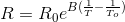

# Huzzah-Thermistor
Using an Adafruit Feather Huzzah ESP8266 to send thermistor readings to a web database.

## Rationale
Trying to keep an eye on my hot water provider presented a great opportunity to try some IoT fun. 

## Hardware
I used an [Adafruit Feather Huzzah](https://learn.adafruit.com/adafruit-feather-huzzah-esp8266/overview) as my micro-controller for it's built in wifi and battery facilities.
The Feather Huzzah has a single analogue pin with a max voltage in of 1V.

Hence a extra step in the voltage divider was needed to bring down the Feathers 3.3V supply. Being rusty in my electronics I simulated the temperature / voltage realtionship in Excel first to get the values needed not to damage the Feather. These resistor values ensure the analogue voltage is less than 1V at temperatures above 5 degrees.

This page [Using a thermistor](https://learn.adafruit.com/thermistor/using-a-thermistor) was very useful for code and maths links.
In the following equation:
* Ro = resistance at 25 degrees C (10K)
* To = 25 degrees C - however temperatures in the equation should be in Kelvin (add 273.15 to C to get K)
* B = coefficant (3435 for my thermistor)

## Device Code
The code on the Feather contains only minor edits from the examples in the links above to read the thermistor value and post to the server.
## Server Code - Data In
PHP seemed the natural choice - being built into my hosting providers web server. The data is filtered and posted to the database. The timestamp of the data comes from the database which saves the need for a realtime clock.
## Server Code - Data Out

### JSON Server

### DC.js / D3.js Visualisation

## To Do
